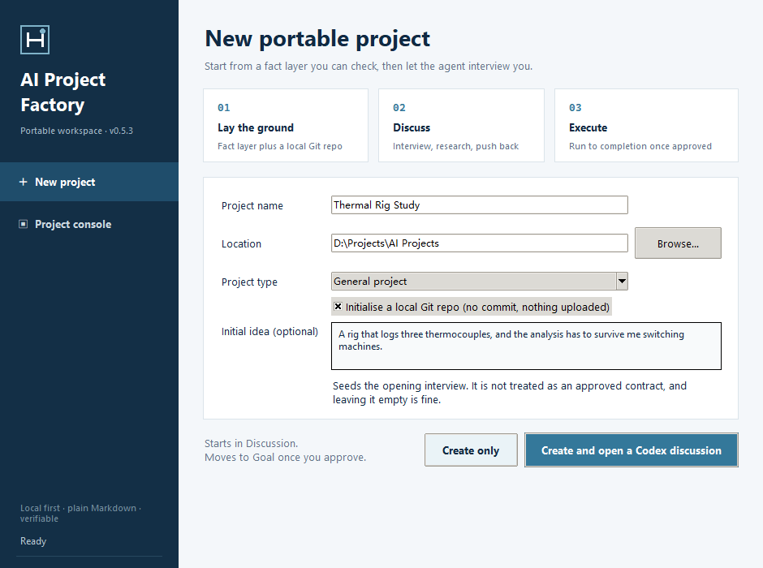
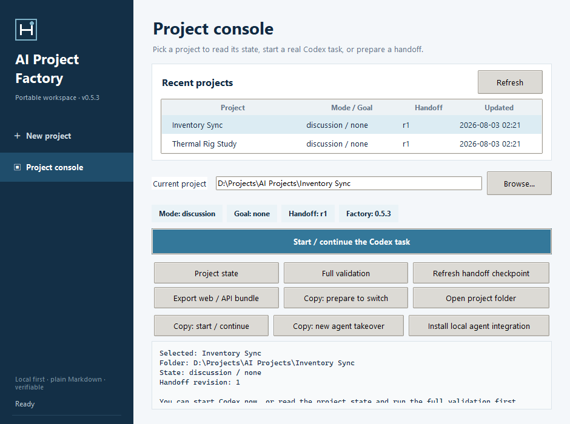

<p align="center">
  
</p>

<h1 align="center">AI Project Factory</h1>

<p align="center">
  A project workspace that survives your coding agent losing its memory.
</p>

<p align="center">
  <a href="https://github.com/TeresaCSR/ai-project-factory/actions/workflows/ci.yml"></a>
  
  
  <a href="LICENSE">
  </a>
</p>

---

Long agent sessions end the same way. The context window fills, the session
compacts, and the model that spent two days building a mental model of your
project is replaced by one that has never seen it. You paste a summary. It is
subtly wrong, because it was written by the model that was about to forget.

Chat memory features do not fix this, because the thing worth keeping was never
the conversation. It was the decisions.

AI Project Factory keeps them in plain Markdown files, in your project folder,
under your control:

```text
PROJECT_CONTRACT.md   what we agreed to build, and what "done" means
PROJECT_CONTEXT.md    verified background a newcomer cannot infer
DECISIONS.md          append-only: what was chosen, what was rejected, why
ACTIVE_GOAL.md        the current objective and any steering since
HANDOFF.md            a short receipt for whoever picks this up cold
```

A new agent -- a fresh Codex thread, a new Claude Code session, a different
model entirely -- opens the folder, reads five files, and knows where things
stand. No summary written under amnesia, no "as we discussed earlier".



## The part that is actually load-bearing

Most agent-scaffolding tools generate a folder of templates and stop. The
useful behaviour is a state machine with exactly one gate in it.

A project is in **Discussion** or in **Goal**, never both.

In Discussion the agent is expected to argue with you: research, compare
routes, prototype reversibly, push back on the plan. It cannot silently decide
what is being built, because writing the contract requires an explicit commit
step that only passes once every fact file validates.

In Goal it stops asking whether to continue. New messages are absorbed as
steering and it keeps working. That distinction is the whole point: the failure
mode of an agent without one is a plan that mutates every time you type, and
an agent that asks "shall I proceed?" after each step.

```text
python .ai/project_runtime.py commit-discussion --updated-by <agent>
```

If any file fails validation, the project stays in Discussion. A half-written
contract is worse than none, so the gate refuses rather than half-commits.

## Handoff, tested against the case that matters

The interesting test is not "does a new chat read the files". It is what
happens when the process dies mid-write.

Every lifecycle command is serialised by a cross-process lock and writes a
recovery journal before touching anything. If the process is killed between
two directory replacements, the next command rolls the whole thing back --
but only while the files are still the versions the transaction recorded. If
someone edited them by hand after the crash, recovery stops and preserves the
scene instead of silently overwriting the newer edit.

That path is covered by fault injection, not by assertion: kill the process at
each phase, restart, and check what the recovery does. What is *not* claimed is
durability against sudden power loss, since that depends on filesystem cache
behaviour this project does not control.



## Getting started

Requires Python 3.10+ and Tkinter. No third-party packages.

**Windows, no terminal:** double-click
[`AI Project Factory.cmd`](AI%20Project%20Factory.cmd). The launcher checks the
Python version and Tkinter first, then starts the GUI with `pyw`/`pythonw`; if
anything fails, it tells you where the diagnostic log is.

To pin it to the desktop, double-click
[`Install or Update Desktop Shortcut.cmd`](Install%20or%20Update%20Desktop%20Shortcut.cmd).
It deploys a GUI-smoke-tested payload to
`%LOCALAPPDATA%\AI Project Factory\current` and creates one unversioned
shortcut. Later updates swap `current` in place, so the shortcut never needs
rebuilding, and a failed deployment leaves the previous working copy alone.
A shortcut of the same name that Factory did not create is never overwritten.

This is an explicit, local update channel -- not a background auto-updater.

**Any platform, from source:**

```bash
python run_factory.py gui
```

## Working with a project

The agent runs these; you should not need a terminal.

| Situation | Command |
|---|---|
| Approved the plan, start building | `commit-discussion --updated-by <agent>` |
| Steering that changes future work | `steer "<what changed>" --updated-by <agent>` |
| About to compact or switch agents | `checkpoint --updated-by <agent>` then `doctor` |
| Pause, block, invalidate, finish | `pause` / `block` / `invalidate` / `complete` |
| Target model cannot read local files | `export` |

Steering that changes deliverables, hard constraints, or acceptance criteria
should bump the contract revision first, with a reason. The Core folds the new
contract revision into the checkpoint while keeping the project in `goal /
active`.

`HANDOFF.md` is for substantive events -- a mode change, a milestone, a real
blocker, preparing to switch. Not every turn. A memory system that demands
constant maintenance has become the work rather than supporting it.

## Switching between agents

Codex and a local Claude Code both open the same folder. Nothing is exported;
they read the same files.

A browser or bare-API model cannot read your disk, and that is the only case
where `export` applies. It writes a bundle from a project-level allowlist,
which gives the model the facts without pretending it has local tools.

Optionally, the GUI installs a Factory-managed skill into `~/.agents/skills`
and `~/.claude/skills`, from a single shared source. Nothing is uploaded and
no cloud session is touched. The installed bridge records where this copy of
Factory lives, so re-run it if you move the folder or change interpreter.

## What this deliberately does not do

- **No cloud sync, no task database, no auto-upgrade.** The fact layer is
  files you can read, diff, and back up yourself.
- **No pre-compact hook assumption.** Not every runtime offers one reliably,
  so explicit checkpoints stay necessary.
- **No chat summarisation.** The GUI cannot read your Codex or Claude
  conversation, and does not pretend to. Semantic handoff is the agent's job;
  the Core owns atomic state, revisions, fingerprints, and validation.
- **No guessing.** A new project starts at `discussion / none`. It does not
  infer your stack, your constraints, or your acceptance criteria.
- **No global config changes** unless you click the button that says it will.

## Verification

```bash
python -m unittest discover -s tests -v
python run_factory.py gui --smoke-test
```

82 tests. They cover atomic creation and refusal to overwrite, the Discussion
gate, Goal steering, pause/resume/complete, handoff freshness, compact
checkpoints, hard process termination with partial writes, concurrent locking,
Git executable-bit and conflict-index fingerprints, migration bundle
snapshots, and secret interception.

Fault injection additionally covers a second crash after an uneven phase copy,
half-cleaned staging snapshots, symlink and Windows junction no-follow,
manual-edit protection, and malformed journals. Deterministic brand asset
builds, multi-size ICO optical calibration, and wheel installation in a clean
offline environment have their own regressions. The fixed `launch.vbs` is
compiled and executed by a real Windows Script Host against a path containing
spaces before every deployment, so the GUI smoke test cannot bypass the
desktop launch chain.

CI runs on Ubuntu, Windows, and macOS across Python 3.10-3.13.

## Documentation

- [First run walkthrough](docs/first-run.md) -- ten minutes, no terminal
- [Validation report](VALIDATION.md) -- what was measured, on what
- [Roadmap](ROADMAP.md) -- candidate directions, not commitments
- [Branding](assets/branding/README.md) -- the mark and how it is generated

## License

MIT. See [LICENSE](LICENSE).
