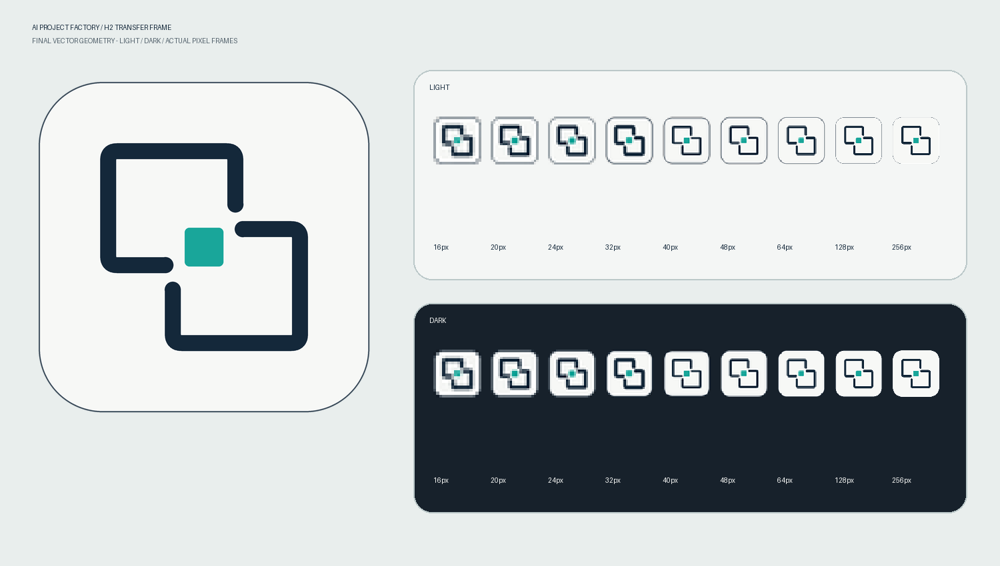

# Branding


**H2 — Transfer Frame** is the mark. Two open, rotationally symmetric frames:
different agents, continuing around one portable project core.

It came out of two rounds of exploration. The first round covered four
directions -- a portable portal, a handoff fold, a layered core, and a relay
orbit -- and the second narrowed to a core gate, open layers, and this. The
concept sheets are not committed; only the approved mark and the code that
generates it are, so nothing here can drift out of sync with what ships.

## Artwork

| File | Role |
|---|---|
| `master/ai-project-factory-h2.svg` | Vector source of truth |
| `master/ai-project-factory-h2-512.png` | 512 px raster master |
| `previews/ai-project-factory-h2-qa.png` | Light/dark size QA sheet |
| `desktop/ai-project-factory.ico` | 16/20/24/32/40/48/64/128/256 px frames |



Every output is generated from one set of geometry constants:

```bash
python scripts/build_brand_assets.py
```

The build is deterministic -- run it twice and the bytes match -- and the test
suite rebuilds each asset and compares it against what is committed, so a stale
checked-in file fails CI rather than shipping quietly.

The small ICO frames are rendered independently, with explicit optical
adjustments to stroke weight, gap, and core size. Downscaling one large PNG
turns the frames to mush at 16 px, which is the size users actually see most.

To pick the new icon up on the desktop:

```bash
python scripts/deploy_windows_desktop.py
```

The shortcut keeps its name and launcher target; only the icon path changes, to
a content-addressed filename, because Windows will otherwise serve a stale
preview from its icon cache indefinitely.
